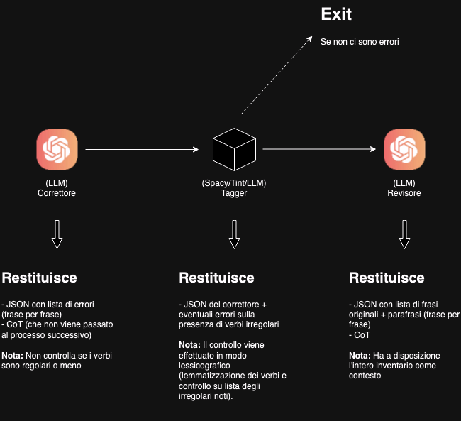

# Worklog

## F.1 - Constraints based text generation

As a first research objective we focused on text generation given a set of linguistics constraints.

Specifically:
- We chose the CEFR A1 level of language proficiency for our text generation tasks.
- We selected 3 target languages: English, Italian and Russian.
- We selected a set of (multi-lingual) LLMs to use for our text generation tasks (gpt-4o, llama 3.1, Mixtral 8x7b, ~~gemini~~ ...)

### Defining a set of suitable writing tasks
To define a set of suitable writing tasks we referenced the CEFR Companion Volume for teachers and learners.

The CEFR framework defines only a list of language production (oral/written) and reception (oral/written) objectives.

Morpho-syntactic items a learner should be able to use are specific to the language and may also vary between language courses programs.

We focused primarily on the 'receptive (written)' items listed for A1 proficiency level. A complete itemized list, extracted from the CEFR Companion Volume, is available [here](https://docs.google.com/document/d/1b42g0Jf0bsDng8b3Alx4XeyjpWfw1F5pkZ7YKi06lbU).

We defined 4 tasks:
- Writing a postcard
- Describing the daily routine of a specific professional figure
- Giving directions to a passerby
- Writing a brief social media post

Each task proposed was inspired from an item listed in the CEFR inventory. Detailed information is presented in this [document](https://docs.google.com/document/d/1eqdsPgBh1bsrBlbUPx1yYgrikcze4nYq_iNBtX3RFwU).

To add some variety to our prompts, we parametrized the writing task 'theme' (e.g. the 'city from where the postcard was written from' for the postcard writing task).

By parametrizing the 'theme' we were able to build a set of ~100 user prompts to submit and then evaluate.

### Linguistics constraints
As stated in the previous section, the CEFR framework does not define which mopho-syntactic language features a learner should know and be able to use.

To build our language inventories we sourced a variety of documents from language teaching/training entities. When applicable, we selected the morpho-syntactic elements listed as 'language reception' objectives for A1 learners.

The inventories we assembled list every grammatical and syntactical element that can be used to complete the writing task proposed.

Inventories are language specific. An effort was made:
- to remove redundant element
- to present information in a hierachical fashion (mainly for information clarity's sake. This is also an overall sound prompt engineering convention.)

This [document](https://docs.google.com/document/d/11e0GFoavUTXkjSIVbYkgDbfPdKL7Jjy0qdq9vmepLP0) offers a complete picture in regards to sources used and inventories content.

### (First) Manual evaluation
We used gpt-4o to generate completions for 12 prompts (actually 36, 12 for each language). These completions were manually reviewed an labeled with a boolean value (conform to constraints/not conform to constraints).

When applicable, detailed information about compliance errors was also annotated.

The manual evaluation was performed on:
- Text generated using prompts in (taget language) for generation of text in (target language). Annotations available [here](https://drive.google.com/drive/folders/14vfWPtB0h00aFxoFeTBXtoZW6FM-CUgf?usp=drive_link)
- Text generated using prompts in English for generation of text in (taget language). Annotations available [here](https://drive.google.com/drive/folders/1QclYd9l9z23QXJ4dwGq8kT40Hi7Y-_Se?usp=drive_link)

#### Observations
- Prompting the model in English did not improve/deteriorate completions quality.
- Overall the model used (gpt-4o) seemed to perform better (i.e. adhere better to linguistics constraints) in English writing tasks.

### (Second) Manual Evaluation
After collecting completions for our 100 user prompt samples across all three languages and using three different models (gpt-4o, Mixtral 8x7b and Llama 3.1), we performed a second manual evaluation on a wider data sample (25 completions for each language, on all 3 models we collected data for).

**Note:** Mixtral 8x7b was not trained on Russian. Mixtral output was annotated only for Italian and English.

The manually annotated data is available [here](https://drive.google.com/drive/u/0/folders/1hCjmNpQX-DOgpWBZ8gYeX0v_E6N2oymZ).

#### Observations
- Mixtral an gpt-4o reach a 24% constraint compliance rate (on 25 samples) on Italian writing tasks. Llama is the worst performing model on Italian writing tasks and reaches a 16% compliance rate.
- All models perform better on English writing tasks. LLama reaches a 100% compliance rate, followed by Mixtral (84%) and gpt-4o (68%).
- All models perform worse on Russian writing tasks (> 20% compliance rate). This may be attributable to training dataset size for Russian language (sadly no data about training data language split has been released by Meta and OpenAI).

### Automatic boolean evaluation
As a first approach to automatic evaluation, we tried to make a LLM perform the inverse tasks, i.e.

```
Given this {text} and {language inventory}, check if the input text conforms to the given linguistics constraints.
```

Expecting a boolean conform/non-conform output (similarly to what we did for manual completions annotation).

We tested this approach on the same 12 prompts/completions couples and noticed very poor results (compared to our manual annnotations).

#### Giving the model some examples (shots)
To check if the poor classification performance could be solved by giving the model some examples (shots), we took another 5 (5 x language) prompts/completition couples and performed another round of manual evaluation.

These 15 samples were then used to build a set of labeled examples to give to the model.

We then re-collected evaluation data for our 12 manually annotated examples in:
- 0 shots context
- 5 shots context (using only examples in (target language))
- 6 shots mixed language context
- 15 shots mixed language context

The data collected is available [here](https://drive.google.com/drive/folders/1-jmvOUAvZ3w4FACjZtOV1zc5qUcKxXiB?usp=drive_link).

#### Observations
The confusion matrix built using the manual evaluation labels as ground truth suggests that giving examples to the model, does not improve classification accuracy.

|                | TP | TN | FP | FN | Accuracy          | Precision         | Recall            |
| -------------- | -- | -- | -- | -- | ----------------- | ----------------- | ----------------- |
| 0 Shots        | 11 | 1  | 24 | 0  | 0.33 | 0.31 | 1.00                 |
| 5 Shots        | 9  | 5  | 20 | 2  | 0.39 | 0.31 | 0.82 |
| 6 Shots Mixed  | 11 | 4  | 21 | 0  | 0.42 | 0.34           | 1.00                 |
| 15 Shots Mixed | 11 | 3  | 22 | 0  | 0.39 | 0.33 | 1.00                 |

| Samples | 36 |
| ------- | -- |
| P       | 11 |
| N       | 25 |

Even considering the low amount of data and the possible presence of biases in the set of examples we chose, we can speculate that this task may be too difficult for a LLM.

### Rule-based evaluation (Italian)
We also tested a rule-based evaluation approach.

**Core idea:** separate the text analysis (morpho-syntactic features extraction) and evaluation processes.

Starting from our Italian inventory we tried to define a set of user prompts to analyze (separately) each part-of-speech.

Examples:
- **Pronouns:** Extract the pronouns contained in the input text and find out their catagory
- **Verbs:** Extract all verbs and annotate their morphological features
...

A general idea on how this solution was then implemented is described in the following sections.

#### Step 1 - POS Tagging
We found out that, even for basic linguistics analysis tasks (e.g. pronouns extraction and categorization), gpt-4o struggles a lot on Italian text.

To aid the model in morpho-syntactical analysis tasks we tried to pre-process the input text with a part-of-speech tagging module.

We tested 3 POS tagging methods:
- (Spacy)[https://spacy.io/] (a multi-lingual NLP python library)
- LLM-driven analysis (using a specific user prompt)
- (Tint)[https://dh.fbk.eu/research/tint/] (this italian-specific NLP tool is based on stanza)

The final output of this pre-process step is a JSON array containing each word of the original text along with its POS tag (see universal POS tags [HERE](https://universaldependencies.org/u/pos/)).

```json
[
    {
        "text": "Certo",
        "pos": "INTJ"
    },
    {
        "text": "!",
        "pos": "PUNCT"
    },
    {
        "text": "Vai",
        "pos": "VERB"
    },
    {
        "text": "dritto",
        "pos": "ADV"
    },
    {
        "text": "per",
        "pos": "ADP"
    },
    {
        "text": "due",
        "pos": "NUM"
    },
    {
        "text": "isolati",
        "pos": "NOUN"
    }
]
```

#### Step 2 - (Grammar) Information extraction
Using the tagged text as input, we defined a set of user prompt to analyze and extract linguistics information relevant to our Italian inventory.

The prompts used, in a 0 shots context, are POS specific but overall very similar in structure.

Given the tagged text as input, we ask the model to analyze a specific POS (e.g. verbs) and extract relevant grammatical/morphological information.

A JSON schema is given as context and the request is to return a JSON object (or array) conform to the schema given.

An example for numbers:
```
Given the following part-of-speech (POS) tagged text:

{input}

Extract and analyze any number contained, indipendently from its function within the
source text.

Respond with a structured JSON array conforming to the schema attached below. No additional comment or data is required.
{
    "$schema": "https://json-schema.org/draft/2020-12/schema",
    "$id": "/schemas/numbers_it.json",
    "title": "Numbers",
    "description": "A list of numbers",
    "type": "array",
    "items": {
        "type": "object",
        "description": "Describes a number",
        "properties": {
            "text": {
                "type": "string",
                "description": "The number extracted"
            },
            "kind": {
                "enum": ["ordinale", "cardinale"],
                "description": "The number kind"
            }
        },
        "required": ["text", "kind"]
    }
}
```

#### Step 3 - (Syntax) Information extraction
To validate Italian syntactical constraints we basically needed an 'analisi logica del periodo' on the input text.

The approach we chose is similar to the one described in the previous sections.

In this case the prompt contains the original, untagged text.

A complex JSON schema representing an 'analisi logica del periodo' of a text of arbirary length is given as context and used to explain to the model the expected output format.

Information we try to extract include:
- Clauses contained in each sentence.
- Clauses kinds (main/coord./sub.).
- Clauses functions/types
- Subordination rank (where applicable)

#### Step 4 - Evaluation
The results of the previous 3 steps are combined in a JSON formatted 'analysis document'.

Validation is carried out by statically parsing this JSON object via code.

The final output contains a set of boolean labels that tell:
- If the input text respects all constraints present in the given inventory.
- If it respects specifically constraint sets on verbs, pronouns, numbers and syntax.
- A list of descriptive error messages (text) if the input is found to be non-compliant.

#### (Note) Dealing with Italian Irregular Verbs
_This issue is explained in-depth in the second section of this worklog_

gpt-4o was found to be widely unreliable in dealing with Italian regular verbs (0 shots classification scenario).

To solve this issue we opted for a lexicographic comparison with a list of known Italian irregular verbs. The final implementation uses this approach to check for verbs regularity.

#### Observation
- This approach was found to be more robust than the boolean LLM based evaluation, however is strongly based on the content and structure of our italian invetory (language dependent).
- There are some open issues regarding Italian syntax analysis (no standard practices/conventions for 'analsi logica del periodo').
- Grammatical/morphological analysis is still carried out using an LLM. Additionally the output quality of the POS tagging module can greatly influence the overall reliability of this automated evaluation system (as a whole, ndr).
- No statistical analysis was performed to find out which POS tagging performs better.

## F.2 - Constraints based paraphrasing
The following sections briefly describe what was done in regards to our secodary study focus i.e. iterative paraphrasing of text to fit within constraints of a given linguistics inventory.

### Core Idea
The core idea behind this approach can be described as follows:
1. Take an arbitrary complex text, generated with/without linguistics constraints.
2. Ask the model to check, for every sentence, if the constraints we want to validate are satisfied.
    - If satisfied: keep text as is.
    - If not satisfied: transform the original text to satisfy the given constraints.

This process can then be performed iteratively until no further changes are needed to make the text fit in our constraints lists (this is the de-facto exit condition of our implementation).

### First Iteration
We used a highly structured prompt (following ideas taken from meta-prompting prompt engineering approach) and ask the model to apply chain-of-thought to formulate their response.

Asking for a CoT was found to be a necessity to make the model to orderly consider all constrainst listed.

Additionally, manual analysis of the model's CoT, gives insights about linguistics elements the model fails to understand properly.

```
# Task:
Check if the given text complies with the constraints provided; generate a paraphrase when necessary.

# Original Text:
{input_text}

# Constraints checking:
Check every sentence againts ALL constraints given.
- If it violates no constraint, keep it as is.
- If it violates one or more constraints, paraphrase or remove it.

# Paraphrasing:
- A paraphrase has to preserve the original semantic meaning and minimize information loss.
- A paraphrase has to replace every non-constraints conformant element with an equivalent conformant alternative.
- If a paraphrase that preserves the original meaning and completely conforms to the given constraints cannot be formulated, then the original text should be removed.

# Output format:
Provide a step-by-step reasoning to elaborate your answer. The expected final output consists of the transformed text, enclosed in <angle brackets>.

# Constraints:
{constraints}
```

**Issues:** To extract and iterate over the transformed text, we ask  the model to use specific delimiters to enclose its final response (this is non-optional as the response also contains all the model's reasoning steps).

The code that parses the model's response uses basic ReGEX expressions to extract the tranformed text.

This means that depending on how closely the model is able to follow the instructions given, the whole iteration process may fail or succeed.

#### Reviewing Inventories
To formulate this 'rewriting' task as a constraints lead paraphrasis, we reviewed our linguistics inventories.

We originally wrote them as a list of morpho-syntactic 'items', so to fit within our paraphrasing prompts, we had to rewrite them as lists of instructions on allowed/non-allowed items.

No specific strategy was implemented to carry out this manual revision. We generally tried to optimize our constraints list for structure and clarity, using OpenAI's playground to informally check for issues and reword complex/unclear sentences.

An example on how the italian inventory was processed:
```
- Nouns, Adjectives, Adverbs, Prepositions, Conjunctions, and Interjections: These may be used without limitations.
- Pronouns: Only personal, possessive, demonstrative, interrogative, and indefinite pronouns are allowed.
- Numerals: Cardinal numbers may be used without limitation. Ordinal numbers must be limited to range 1-3.
- Verbs: essere, avere, volere, potere, dovere, and regular Italian verbs are allowed. Any other irregular verbs are forbidden.
- Verbs have to be conjugated in active voice.
- Verbs have to be conjugated strictly in the following moods and tense combinations:
    - Indicativo: presente e passato prossimo
    - Infinito: presente
    - Imperativo: presente (only 2nd singular and plural persons)
- Simple clauses may only assume declarative, volitive (using imperative mood), or interrogative functions.
- Coordinate clauses may only be copulative, adversative, or declarative.
- Subordinate clauses may only assume causal, temporal, final (in implicit form), hypothetical (introduced by 'se'), or relative functions.
```

### Sentence-By-Sentence paraphrasing
We informally observed a tendency in looping over paraphrasis of irregular verbs (for Italian inputs) and, in some cases, the lack of attention on some constraints sequencially listed in our inventories.

Also, as a widespread issue, we noticed a general lack of logical 'soundness' in the paraphrases proposed by the model (i.e. bad, unnatural, or overall unsound substitutions).

A preliminary analysis on output data using our first implementation (on English language) is available [here](https://docs.google.com/spreadsheets/d/1h16vICpQyBoTFmUQGMzBrDeMCXLTKZYFmPumB-rRVZc/edit?gid=2129388210#gid=2129388210).

We assumed an issue with input length, so we also tested a sentence-by-sentence paraphrasing approach.

The prompt we used is very similar to the one attached to the previous section, therefore it is not included here.

**Note:** Sentencizing was carried out using spacy (for all languages). This is a simple NLP task and no issue was observed across analyzed data.

#### Observations
To get an idea on recurring paraphrasing issues, we manually checked a set of 12 paraphrases in Italian and Russian, comparing the two methods (full-text paraphrasing and sentence-by-sentence).

The Italian annotations are available [here](https://docs.google.com/spreadsheets/d/1VFGowGpYmdtNCS8_tlWsWSrVpbMbNS1C/edit?usp=drive_link&ouid=111186755018075460643&rtpof=true&sd=true) and the Russian annotations [here](https://drive.google.com/drive/u/0/folders/10AVAk_LPsTgfrOY0oMPCoJt0eEnh1pgn).

We observed:
- (Italian) No performance gain/loss between the two methods. Also paraphrases quality seems overall unaffected by the method used.
- (Italian) A generalized difficulty in checking and paraphrasing irregular verbs. Also (less severe) a difficulty in correctly identifying tenses and moods (within our allowed/not-allowed verbs constraints).
- (Russian) A similar issue in cataloguing regular/irregular verbs.
- (Russian) A noticeable improvement in paraphrases quality using the sentence-by-sentence approach.
- (Both) Overall a lack of quality, and in some cases logical unsoundness, in proposed paraphrases.

### Dealing with irregular Verbs (Italian)
Our preliminary analysis of paraphrases for Italian texts revealed a widespread issue in dealing with irregular verbs.

A quick test revealed, at least for gpt-4o, a lack of understanding about the concept of regular/irregular verbs in 0 shots contexts.

We saw the best results in dealing with irregular when:
- By using a specific 'meta-prompting' style instructions list describing a complete procedure to check for irregular italian verbs. In 0 shots contexts the model is still unable to recognize verbs that present minor 'irregularities' (e.g. 'Assistere'). An example is attached below
- By including a list of known irregular verbs as context in our user prompt (note that this approach, while functional consumes a lot of input tokens)

```
Check if the following Italian verb is regular or irregular.

---
{verb}
---

Procedure:
1. Find the verb's lemma (e.g. 'ho mangiato' -> mangiare).
2. Choose a known regular verb belonging to the same conjugation. Known regular verbs include:
  - 1st conj. ('are') -> 'cantare'
  - 2nd conj. ('ere') -> 'ricevere'
  - 3rd conj. ('ire') -> 'partire'
3. Conjugate both verbs in all finite and non-finite moods.
4. Compare the results to define if the given verb is regular or irregular. Italian irregular verb may present one or more of the following patterns:
  - root changes when conjugated in some mood/tense combinations.
  - suffix changes (when compared to a regular verb of the same conjugation) in some mood/tense combinations.
  - unpredictable thematic modifications when conjugated in some mood/tense combinations.
  
Output format:
Include your reasoning process in your response. The final expected output is a boolean value telling if the given verb is/isn't regular. Reference the following JSON template:

---
{
	'verb' : '<the verb analyzed>',
	'regular': <true/false>
}
---
```

### Lexicographic Analysis
Considering the issues described in the previous section, we decided to try to manage irregular verbs 'outside' of the LLM constraints analysis/paraphrasing loop.

We built a list of known irregular verbs by querying Wikitionary for items catalogued under "Italian Irregular Verbs", see this [url](https://en.wiktionary.org/wiki/Category:Italian_irregular_verbs).

The result is a 8K token length list. To optimize token usage we opted for a static lexicographic comparision.

Briefly, the module used to check for irregular verbs presence performs the following steps:
- POS tagging (using one of the following: Spacy, Tint, or a LLM prompted with a specific user prompt) and lemmatization
- Selection of elements tagged as VERB
- Comparison of their lemma with our known-irregulars list

Results quality seems to vary a lot between POS tagging method.

### Implementation
The irregular verbs analysis described above was implemented in a 2-Steps Paraphrasing system.

We decided to separate the analysis task in two sub-tasks
- **error detection:** By prompting an LLM to just check, sentence-by-sentence, for errors in constraints adherence (given a linguistics constraints list as context).
- **error correction:** By using the error list returned from the first analysis step to effectively paraphrase, within the boundaries defined by the same constraints lists, unconformant items.

The constraints on irregular verbs are not checked during the error detection process and this operation was delegated to a module, based on a POS tagger, that enriches the first analysis outputs with additional info about irregular verbs (if any are present).

A schema is attached below for clarity.
. 

#### Observation
While this solution deals better with irregular verbs detection and substitution, we observed no improvements in subsitutions **logical soundness**.

We can hypothesize a lack of understanding on what constitutes a **paraphrase that preserve the original semantic meaning and minimize information loss**. Note that at the moment of writing in-depth analysis (on a small subset of data) was performed only on gpt-4o.